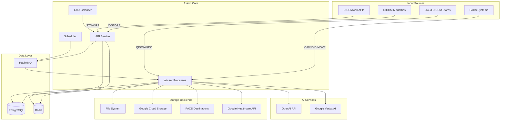

# System Architecture Overview

Axiom is built as a modern, cloud-native medical imaging platform designed for enterprise scale. This document provides a high-level overview of the system architecture, design principles, and key components.

## Design Principles

### 1. **Healthcare-First**
- HIPAA compliance built into every component
- DICOM standard compliance with zero compromise
- Audit logging for all operations
- Secure by default configuration

### 2. **Scalability**
- Horizontal scaling through stateless services
- Async processing for high throughput
- Cloud-native deployment patterns
- Resource-efficient operations

### 3. **Reliability**
- Exception handling and retry mechanisms
- Health checks and monitoring
- Graceful degradation
- Data integrity guarantees

### 4. **Flexibility**
- Pluggable storage backends
- Configurable processing rules
- Multi-source data ingestion
- Extensible AI integration

## System Overview



## Core Components

### API Service
**Technology**: FastAPI with async/await  
**Purpose**: REST API for configuration, monitoring, and real-time operations

**Key Features**:
- RESTful configuration APIs
- Real-time WebSocket connections for monitoring
- OAuth 2.0 and API key authentication
- Role-based access control (RBAC)
- Interactive API documentation (Swagger UI)
- Health checks and metrics endpoints

**Endpoints**:
- `/api/v1/config/*` - Configuration management
- `/api/v1/auth/*` - Authentication and user management
- `/api/v1/monitoring/*` - System health and metrics
- `/api/v1/dicomweb/*` - DICOMweb STOW-RS endpoint
- `/health` - Service health check

### Worker Processes
**Technology**: Celery with async task processing  
**Purpose**: Background processing of DICOM files and system operations

**Key Functions**:
- DICOM file processing and validation
- Rule engine execution
- Tag morphing and standardization
- Storage backend operations
- AI integration tasks
- Exception handling and retry logic

**Task Types**:
- `process_dicom_file` - Main DICOM processing pipeline
- `poll_dicomweb_source` - Poll external DICOMweb APIs
- `poll_dimse_source` - Query DIMSE sources
- `sync_crosswalk_data` - Update lookup tables
- `retry_failed_operations` - Exception recovery

### Scheduler
**Technology**: Celery Beat  
**Purpose**: Periodic task scheduling and system maintenance

**Scheduled Tasks**:
- Source polling (every 1-60 minutes)
- Crosswalk data synchronization (daily)
- Exception retry attempts (every 15 minutes)
- System health checks (every 5 minutes)
- Log rotation and cleanup (daily)

## Data Architecture

### PostgreSQL Database
**Purpose**: Primary data store for configuration and metadata

**Key Tables**:
- `users` - User accounts and authentication
- `storage_backends` - Output destination configurations
- `rulesets` & `rules` - Processing rule definitions
- `dicom_studies` - DICOM metadata and processing status
- `exception_logs` - Failed operations and retry tracking
- `crosswalk_data_sources` - External database connections
- `audit_logs` - Compliance and security logging

### Redis Cache
**Purpose**: Session management, temporary data, and caching

**Usage**:
- User session storage
- Celery result backend
- Crosswalk lookup caching
- Rate limiting data
- Temporary file references

### RabbitMQ
**Purpose**: Task queue and message routing

**Queues**:
- `celery` - Default task queue
- `high_priority` - Urgent processing tasks
- `low_priority` - Background maintenance tasks
- `retry` - Failed task retry queue

## Processing Pipeline

### 1. **Ingestion Phase**
```python
# C-STORE reception
DICOM File → Validation → Queue Processing Task

# STOW-RS reception  
HTTP Upload → Multipart Parsing → Queue Processing Task

# Polling ingestion
Scheduled Poll → Query Source → Queue Processing Tasks
```

### 2. **Processing Phase**
```python
Process Task → Load Rules → Apply Conditions → Execute Actions → Route to Storage
```

### 3. **Storage Phase**
```python
Storage Task → Backend Selection → Transfer → Verify → Update Status
```

## Security Architecture

### Authentication
- **OAuth 2.0**: Google OAuth for user authentication
- **API Keys**: Service-to-service authentication
- **JWT Tokens**: Session management with configurable expiration

### Authorization
- **Role-Based Access Control (RBAC)**:
  - `superuser` - Full system access
  - `admin` - Configuration and user management
  - `user` - Read-only access to own data

### Data Protection
- **Encryption in Transit**: TLS 1.3 for all communications
- **Encryption at Rest**: Database and storage encryption
- **DICOM Anonymization**: Configurable tag removal/modification
- **Audit Logging**: All operations logged with correlation IDs

### Network Security
- **Container Isolation**: Docker network segmentation
- **Service Mesh**: Optional Istio integration for production
- **Firewall Rules**: Minimal port exposure
- **VPN Integration**: Support for healthcare network requirements

## Deployment Architecture

### Container Structure
```yaml
services:
  api:          # FastAPI application
  worker:       # Celery worker processes  
  beat:         # Celery scheduler
  postgres:     # Primary database
  redis:        # Cache and session store
  rabbitmq:     # Message queue
  nginx:        # Load balancer and TLS termination
```

### Scaling Patterns
- **Horizontal**: Multiple worker instances for throughput
- **Vertical**: Larger containers for memory-intensive operations
- **Database**: Read replicas for query performance
- **Storage**: Multiple backends for redundancy

### Cloud Deployment
- **Kubernetes**: Full K8s deployment with Helm charts
- **Google Cloud**: Native GKE and Cloud Healthcare integration
- **AWS**: EKS with healthcare compliance configurations
- **Azure**: AKS with healthcare services integration

## Integration Points

### DICOM Sources
- **C-STORE SCP**: Standard DICOM storage service
- **DICOMweb**: QIDO-RS, WADO-RS, STOW-RS support
- **Google Healthcare**: Native API integration
- **DIMSE Query/Retrieve**: C-FIND and C-MOVE operations

### Storage Destinations
- **File System**: Local or network-attached storage
- **Cloud Storage**: Google Cloud Storage, AWS S3, Azure Blob
- **DICOM**: C-STORE SCU to PACS systems
- **DICOMweb**: STOW-RS to any compliant endpoint

### AI Services
- **OpenAI**: GPT models for rule generation and tag standardization
- **Google Vertex AI**: Gemini models for medical image analysis
- **Custom Models**: Extensible framework for additional AI services

## Performance Characteristics

### Throughput
- **Single Instance**: 1,000-10,000 studies per hour
- **Clustered**: 100,000+ studies per hour
- **Latency**: <1 second rule processing for most operations

### Resource Requirements
- **Minimum**: 4 CPU cores, 8GB RAM, 100GB storage
- **Recommended**: 8 CPU cores, 16GB RAM, 1TB storage
- **Enterprise**: 32+ CPU cores, 64GB+ RAM, 10TB+ storage

### Scalability Limits
- **Database**: 100M+ studies with proper indexing
- **Storage**: Unlimited with cloud backends
- **Concurrent Users**: 1,000+ with load balancing
- **Processing Queue**: 100,000+ pending tasks

## Monitoring and Observability

### Health Checks
- **Liveness Probes**: Service availability
- **Readiness Probes**: Service ready to accept traffic
- **Dependency Checks**: Database and external service health

### Metrics
- **Business Metrics**: Studies processed, rules executed, exceptions
- **Technical Metrics**: Response times, queue lengths, resource usage
- **Security Metrics**: Authentication events, failed requests

### Logging
- **Structured Logging**: JSON format with correlation IDs
- **Log Levels**: DEBUG, INFO, WARNING, ERROR, CRITICAL
- **Log Aggregation**: Centralized logging with search capabilities

---

This architecture supports healthcare enterprises processing millions of studies annually while maintaining HIPAA compliance and DICOM standards. The modular design allows for gradual adoption and scaling based on organizational needs.
