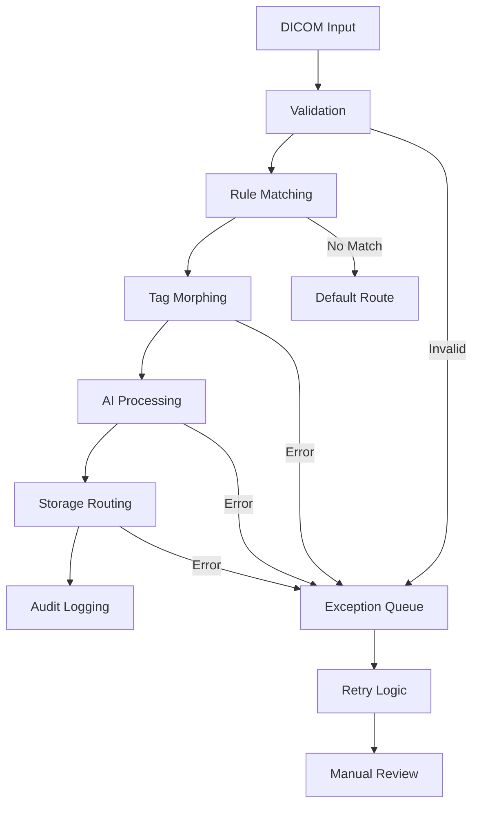

# DICOM Processing

Axiom's DICOM processing engine is the heart of the platform, handling medical imaging data with full DICOM 3.0 compliance while providing modern data pipeline capabilities.

## Processing Pipeline Overview



## DICOM Input Sources

### 1. C-STORE Reception (SCP)
Axiom runs DICOM Storage Service Class Provider (SCP) listeners to receive images from modalities and PACS systems.

**Configuration:**
```json
{
  "name": "main-listener",
  "ae_title": "AXIOM",
  "port": 11112,
  "host": "0.0.0.0",
  "max_pdu_size": 16384,
  "enabled": true,
  "instance_filter": "prod"
}
```

**Supported Transfer Syntaxes:**
- Implicit VR Little Endian (1.2.840.10008.1.2)
- Explicit VR Little Endian (1.2.840.10008.1.2.1)
- Explicit VR Big Endian (1.2.840.10008.1.2.2)
- JPEG Baseline (1.2.840.10008.1.2.4.50)
- JPEG 2000 Lossless (1.2.840.10008.1.2.4.90)

**Example Implementation:**
```python
# DICOM association handling
def handle_store(event):
    """Handle incoming C-STORE request"""
    try:
        # Validate DICOM file
        dataset = event.dataset
        
        # Queue for processing
        task = process_dicom_file.delay(
            dataset_path=temp_file_path,
            source_type="c_store",
            association_info={
                "calling_ae": event.assoc.requestor.ae_title,
                "called_ae": event.assoc.acceptor.ae_title,
                "source_ip": event.assoc.requestor.address
            }
        )
        
        return 0x0000  # Success
    except Exception as e:
        logger.error(f"C-STORE error: {e}")
        return 0xC000  # Failure
```

### 2. DICOMweb STOW-RS
RESTful endpoint for DICOM upload following DICOMweb standards.

**Endpoint:** `POST /api/v1/dicomweb/studies`

**Content Types:**
- `multipart/related; type="application/dicom"`
- `application/dicom`

**Example Usage:**
```bash
curl -X POST "https://axiom.example.com/api/v1/dicomweb/studies" \
  -H "Authorization: Api-Key YOUR_API_KEY" \
  -H "Content-Type: multipart/related; type=application/dicom; boundary=boundary123" \
  --data-binary @multipart_dicom.dat
```

### 3. Polling Sources

#### DICOMweb Polling (QIDO-RS)
Query external DICOMweb servers for new studies.

```json
{
  "name": "hospital-pacs",
  "type": "dicomweb",
  "base_url": "https://pacs.hospital.com/dicomweb",
  "auth_type": "bearer_token",
  "credentials": {"token": "..."},
  "poll_interval": 300,
  "query_params": {
    "StudyDate": "20250908-",
    "Modality": "CT,MR"
  }
}
```

#### DIMSE Query/Retrieve (C-FIND/C-MOVE)
Traditional DICOM query and retrieve operations.

```json
{
  "name": "legacy-pacs", 
  "type": "dimse_qr",
  "ae_title": "LEGACY_PACS",
  "host": "pacs.legacy.com",
  "port": 104,
  "move_destination": "AXIOM",
  "query_level": "STUDY",
  "poll_interval": 600
}
```

#### Google Healthcare API
Native integration with Google Cloud Healthcare DICOM stores.

```json
{
  "name": "gcp-dicom-store",
  "type": "google_healthcare",
  "project_id": "healthcare-project",
  "location": "us-central1",
  "dataset_id": "imaging-dataset", 
  "dicom_store_id": "main-store",
  "poll_interval": 180
}
```

## DICOM Validation

All incoming DICOM files undergo comprehensive validation:

### 1. **Structure Validation**
```python
def validate_dicom_structure(dataset):
    """Validate DICOM file structure and required elements"""
    required_tags = [
        (0x0008, 0x0018),  # SOPInstanceUID
        (0x0008, 0x0016),  # SOPClassUID
        (0x0020, 0x000D),  # StudyInstanceUID
        (0x0020, 0x000E),  # SeriesInstanceUID
        (0x0010, 0x0020),  # PatientID
    ]
    
    for tag in required_tags:
        if tag not in dataset:
            raise ValidationError(f"Missing required tag {tag}")
    
    # Validate UIDs format
    validate_uid_format(dataset.SOPInstanceUID)
    validate_uid_format(dataset.StudyInstanceUID)
    validate_uid_format(dataset.SeriesInstanceUID)
```

### 2. **Content Validation**
- **Patient Demographics**: Valid date formats, consistent patient data
- **Study Information**: Proper study organization and metadata
- **Image Data**: Pixel data integrity and transfer syntax compliance
- **DICOM Conformance**: SOP Class validation and IOD compliance

### 3. **Security Validation**
- **Malformed Data**: Protection against DICOM parsing exploits
- **File Size Limits**: Configurable maximum file sizes
- **Rate Limiting**: Protection against DoS attacks
- **Content Scanning**: Optional malware scanning integration

## Rule Engine Processing

### Rule Matching Process
```python
def process_rules(dataset, association_info, source_info):
    """Apply rule engine to DICOM dataset"""
    
    # Load active rulesets for this source
    rulesets = get_active_rulesets(source_info.source_type)
    
    for ruleset in rulesets:
        # Check schedule if defined
        if ruleset.schedule and not schedule_active(ruleset.schedule):
            continue
            
        matched_rules = []
        
        for rule in ruleset.rules:
            if evaluate_conditions(rule.conditions, dataset, association_info):
                matched_rules.append(rule)
                
                if ruleset.execution_mode == "FIRST_MATCH":
                    break
        
        # Execute matched rules
        for rule in matched_rules:
            execute_rule_actions(rule, dataset)
            
    return dataset
```

### Condition Types
1. **Tag Equality**: `(0x0008,0x0060) == "CT"`
2. **Tag Existence**: `(0x0010,0x0030)` exists
3. **Pattern Matching**: `(0x0010,0x0010)` contains "JOHN"
4. **Numeric Comparison**: `(0x0018,0x0050) > 5.0`
5. **List Membership**: `(0x0008,0x0060)` in ["CT", "MR"]
6. **Regular Expressions**: `(0x0010,0x0020)` matches `^PAT\d{6}$`

### Action Types
1. **Set**: Add or modify tag values
2. **Delete**: Remove tags from dataset
3. **Copy**: Copy values between tags
4. **Move**: Move values between tags
5. **Crosswalk**: Lookup and replace values
6. **AI Standardize**: Use AI to standardize tag values

## Tag Morphing and Standardization

### Original Attributes Logging
When modifying DICOM tags, Axiom logs original values in the Original Attributes Sequence (0x0400,0x0550) for audit compliance.

```python
def log_original_attributes(dataset, modifications):
    """Log original tag values before modification"""
    if not getattr(settings, 'LOG_ORIGINAL_ATTRIBUTES', True):
        return
        
    original_attrs = Dataset()
    original_attrs.AttributeModificationDateTime = datetime.now().strftime('%Y%m%d%H%M%S')
    original_attrs.ModifyingSystem = "Axiom DICOM Processor"
    original_attrs.ReasonForTheAttributeModification = "Rule Engine Processing"
    
    modified_attrs = Sequence()
    for tag, original_value in modifications.items():
        attr_item = Dataset()
        attr_item.TagPath = tag
        attr_item.OriginalAttributeValue = original_value
        modified_attrs.append(attr_item)
    
    original_attrs.ModifiedAttributesSequence = modified_attrs
    
    # Add to dataset
    if (0x0400, 0x0550) not in dataset:
        dataset[(0x0400, 0x0550)] = Sequence()
    dataset[(0x0400, 0x0550)].append(original_attrs)
```

### AI-Powered Standardization
Axiom integrates with AI services to standardize DICOM tag values:

```python
async def standardize_body_part(dataset):
    """Use AI to standardize BodyPartExamined tag"""
    if (0x0018, 0x0015) not in dataset:
        return
        
    original_value = dataset[(0x0018, 0x0015)].value
    
    # Get standardized value from AI service
    standardized = await ai_service.standardize_body_part(
        original_value,
        modality=dataset.get((0x0008, 0x0060), ""),
        study_description=dataset.get((0x0008, 0x1030), "")
    )
    
    if standardized != original_value:
        # Log original value
        log_modification((0x0018, 0x0015), original_value)
        
        # Set standardized value
        dataset[(0x0018, 0x0015)].value = standardized
```

## Exception Handling and Recovery

### Exception Categories
1. **Validation Errors**: Malformed DICOM files
2. **Processing Errors**: Rule execution failures  
3. **Storage Errors**: Destination write failures
4. **Network Errors**: Communication timeouts
5. **Resource Errors**: Disk space, memory issues

### Automatic Retry Logic
```python
@celery.task(bind=True, max_retries=3, default_retry_delay=300)
def process_dicom_file(self, file_path, source_info):
    """Process DICOM file with automatic retry"""
    try:
        # Main processing logic
        result = execute_processing_pipeline(file_path, source_info)
        return result
        
    except RetryableError as e:
        # Retry for transient errors
        if self.request.retries < self.max_retries:
            raise self.retry(countdown=300 * (2 ** self.request.retries))
        else:
            # Max retries exceeded, log exception
            create_exception_log(file_path, str(e), "max_retries_exceeded")
            raise
            
    except NonRetryableError as e:
        # Immediate failure for permanent errors
        create_exception_log(file_path, str(e), "processing_error")
        raise
```

### Manual Exception Management
The exception management system provides APIs for:

1. **List Exceptions**: Query failed operations with filters
2. **Exception Details**: View complete error information
3. **Manual Retry**: Retry operations after fixing issues
4. **Archive**: Mark exceptions as resolved
5. **Bulk Operations**: Handle multiple exceptions

## Performance Optimization

### Processing Throughput
- **Async Operations**: Non-blocking I/O for network operations
- **Batch Processing**: Group similar operations
- **Worker Scaling**: Multiple Celery workers for parallel processing
- **Priority Queues**: High-priority processing for urgent studies

### Memory Management
- **Streaming Processing**: Process large DICOM files without loading into memory
- **Garbage Collection**: Explicit cleanup of temporary resources
- **Connection Pooling**: Reuse database and network connections

### Storage Optimization
- **Deduplication**: Avoid storing duplicate DICOM instances
- **Compression**: Use DICOM compression for storage efficiency
- **Tiered Storage**: Move older studies to cheaper storage tiers

## Monitoring and Metrics

### Processing Metrics
- **Studies per Hour**: Throughput measurements
- **Processing Latency**: Time from receipt to storage
- **Rule Execution Time**: Performance of rule engine
- **Exception Rate**: Percentage of failed operations

### Health Checks
```python
@router.get("/health/dicom-processing")
async def check_dicom_processing_health():
    """Health check for DICOM processing components"""
    health = {
        "status": "healthy",
        "checks": {
            "listeners": check_listeners_status(),
            "workers": check_worker_status(), 
            "storage": check_storage_health(),
            "queue": check_queue_status()
        }
    }
    
    if any(check["status"] != "healthy" for check in health["checks"].values()):
        health["status"] = "degraded"
    
    return health
```

## Compliance and Security

### HIPAA Compliance
- **Access Logging**: All data access logged with user identification
- **Encryption**: Data encrypted in transit and at rest
- **Audit Trails**: Complete audit trail for all operations
- **Data Minimization**: Only necessary data retained

### DICOM Compliance
- **Standard Conformance**: Full DICOM 3.0 standard compliance
- **SOP Class Support**: Support for all major DICOM SOP classes
- **Transfer Syntax**: Support for common transfer syntaxes
- **IOD Validation**: Ensure proper Information Object Definition compliance

---

This DICOM processing system handles enterprise-scale medical imaging workflows while maintaining the highest standards for healthcare data security and DICOM compliance.
