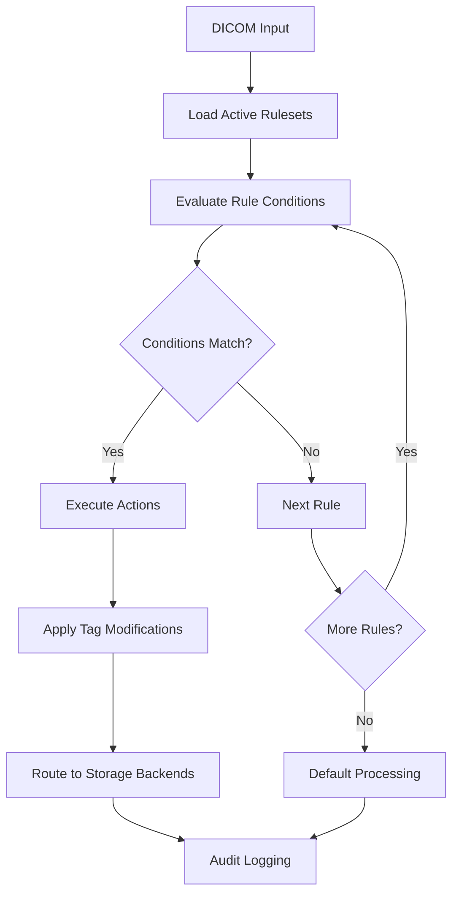

# Rule Engine

The Axiom rule engine is the heart of DICOM processing intelligence. It provides a flexible, powerful system for routing, transforming, and standardizing DICOM data based on configurable conditions and actions.

## Overview

The rule engine processes DICOM files through a series of configurable rulesets. Each ruleset contains multiple rules with conditions that are evaluated against incoming DICOM data. When conditions match, the associated actions are executed.



## Core Concepts

### Rulesets
A **ruleset** is a collection of related rules that are executed together. Rulesets have:

- **Name**: Descriptive identifier
- **Execution Mode**: How rules within the set are processed
- **Source Types**: Which input sources trigger the ruleset
- **Schedule**: Optional time-based activation
- **Rules**: The actual processing logic

### Rules
A **rule** contains:

- **Conditions**: Criteria that must be met for the rule to execute
- **Actions**: Operations performed when conditions match
- **Storage Backends**: Destinations for processed DICOM data
- **Priority**: Execution order within the ruleset

### Execution Modes

**FIRST_MATCH**: Stop processing after the first rule matches
```json
{
  "execution_mode": "FIRST_MATCH",
  "description": "Route to appropriate destination based on modality"
}
```

**ALL_MATCHES**: Execute all matching rules
```json
{
  "execution_mode": "ALL_MATCHES", 
  "description": "Apply all applicable transformations"
}
```

## Condition Types

### Tag-Based Conditions

#### Tag Equality
Match exact tag values:
```json
{
  "type": "tag_equals",
  "tag": "(0x0008,0x0060)",
  "value": "CT",
  "case_sensitive": false
}
```

#### Tag Existence
Check if a tag exists:
```json
{
  "type": "tag_exists",
  "tag": "(0x0010,0x0030)"
}
```

#### Tag Contains
Check if tag value contains a substring:
```json
{
  "type": "tag_contains",
  "tag": "(0x0008,0x103E)",
  "value": "CHEST",
  "case_sensitive": false
}
```

#### Numeric Comparison
Compare numeric tag values:
```json
{
  "type": "tag_numeric",
  "tag": "(0x0018,0x0050)",
  "operator": "greater_than",
  "value": 5.0
}
```

**Supported operators**: `equals`, `not_equals`, `greater_than`, `greater_than_or_equal`, `less_than`, `less_than_or_equal`, `between`

#### Regular Expressions
Advanced pattern matching:
```json
{
  "type": "tag_regex",
  "tag": "(0x0010,0x0020)",
  "pattern": "^PAT\\d{6}$",
  "flags": "i"
}
```

#### List Membership
Check if tag value is in a list:
```json
{
  "type": "tag_in_list",
  "tag": "(0x0008,0x0060)",
  "values": ["CT", "MR", "US", "XA"]
}
```

#### Date/Time Conditions
Work with DICOM date and time values:
```json
{
  "type": "tag_date",
  "tag": "(0x0008,0x0020)",
  "operator": "after",
  "value": "20250101"
}
```

```json
{
  "type": "tag_time",
  "tag": "(0x0008,0x0030)",
  "operator": "between",
  "start_time": "080000",
  "end_time": "170000"
}
```

### Association-Based Conditions

#### Calling/Called AE Title
Match based on DICOM association information:
```json
{
  "type": "association_ae",
  "calling_ae": "MODALITY_CT_1",
  "called_ae": "AXIOM"
}
```

#### Source IP Address
Match based on source IP (supports CIDR notation):
```json
{
  "type": "association_ip",
  "source_ip": "192.168.1.0/24"
}
```

#### Source Type
Match based on how the DICOM was received:
```json
{
  "type": "source_type",
  "source_types": ["c_store", "stow_rs", "dicomweb_poll"]
}
```

### Compound Conditions

#### AND Logic
All conditions must be true:
```json
{
  "type": "and",
  "conditions": [
    {
      "type": "tag_equals",
      "tag": "(0x0008,0x0060)",
      "value": "CT"
    },
    {
      "type": "tag_contains",
      "tag": "(0x0018,0x0015)",
      "value": "CHEST"
    }
  ]
}
```

#### OR Logic
Any condition can be true:
```json
{
  "type": "or",
  "conditions": [
    {
      "type": "tag_equals",
      "tag": "(0x0008,0x0060)",
      "value": "CT"
    },
    {
      "type": "tag_equals",
      "tag": "(0x0008,0x0060)",
      "value": "MR"
    }
  ]
}
```

#### NOT Logic
Negate a condition:
```json
{
  "type": "not",
  "condition": {
    "type": "tag_exists",
    "tag": "(0x0010,0x4000)"
  }
}
```

## Action Types

### Tag Manipulation Actions

#### Set Tag Value
Add or modify DICOM tag values:
```json
{
  "type": "set",
  "tag": "(0x0008,0x103E)",
  "value": "PROCESSED - CHEST CT"
}
```

#### Delete Tag
Remove DICOM tags:
```json
{
  "type": "delete",
  "tag": "(0x0010,0x4000)"
}
```

#### Copy Tag
Copy value from one tag to another:
```json
{
  "type": "copy",
  "source_tag": "(0x0010,0x0020)",
  "target_tag": "(0x0010,0x1000)"
}
```

#### Move Tag
Move value from one tag to another:
```json
{
  "type": "move",
  "source_tag": "(0x0010,0x0020)",
  "target_tag": "(0x0010,0x1000)"
}
```

#### String Manipulation
Modify tag values with string operations:
```json
{
  "type": "prepend",
  "tag": "(0x0008,0x103E)",
  "value": "PROCESSED - "
}
```

```json
{
  "type": "suffix",
  "tag": "(0x0008,0x103E)",
  "value": " - REVIEWED"
}
```

```json
{
  "type": "regex_replace",
  "tag": "(0x0010,0x0010)",
  "pattern": "\\s+",
  "replacement": "_",
  "flags": "g"
}
```

### Data Transformation Actions

#### Crosswalk Lookup
Replace tag values using external database lookups:
```json
{
  "type": "crosswalk",
  "tag": "(0x0018,0x0015)",
  "crosswalk_map_id": "body_part_standardization",
  "default_value": "UNKNOWN"
}
```

#### AI Standardization
Use AI services to standardize tag values:
```json
{
  "type": "ai_standardize",
  "tag": "(0x0018,0x0015)",
  "ai_config_id": "body_part_openai",
  "context_tags": [
    "(0x0008,0x0060)",  # Modality
    "(0x0008,0x1030)"   # Study Description
  ]
}
```

### Data Quality Actions

#### Validate and Correct
Validate tag values and apply corrections:
```json
{
  "type": "validate",
  "tag": "(0x0010,0x0030)",
  "validation_type": "date_format",
  "format": "YYYYMMDD",
  "auto_correct": true
}
```

#### Anonymization
Remove or modify patient-identifying information:
```json
{
  "type": "anonymize",
  "anonymization_profile": "basic_anonymization",
  "preserve_study_structure": true
}
```

### Custom Actions

#### Python Script Execution
Execute custom Python code:
```json
{
  "type": "python_script",
  "script_id": "custom_processing_script",
  "parameters": {
    "threshold": 100,
    "mode": "conservative"
  }
}
```

## Practical Examples

### Example 1: CT Chest Routing
Route CT chest studies to specialized storage with enhanced metadata:

```json
{
  "name": "ct-chest-processing",
  "description": "Process and route CT chest studies",
  "execution_mode": "ALL_MATCHES",
  "source_types": ["c_store", "stow_rs"],
  "rules": [
    {
      "name": "ct-chest-identification",
      "conditions": [
        {
          "type": "and",
          "conditions": [
            {
              "type": "tag_equals",
              "tag": "(0x0008,0x0060)",
              "value": "CT"
            },
            {
              "type": "or",
              "conditions": [
                {
                  "type": "tag_contains",
                  "tag": "(0x0018,0x0015)",
                  "value": "CHEST"
                },
                {
                  "type": "tag_contains",
                  "tag": "(0x0008,0x1030)",
                  "value": "CHEST"
                }
              ]
            }
          ]
        }
      ],
      "actions": [
        {
          "type": "set",
          "tag": "(0x0008,0x103E)",
          "value": "CT CHEST - AXIOM PROCESSED"
        },
        {
          "type": "ai_standardize",
          "tag": "(0x0018,0x0015)",
          "ai_config_id": "body_part_standardization"
        },
        {
          "type": "set",
          "tag": "(0x0012,0x0063)",
          "value": "AXIOM_PROCESSED"
        }
      ],
      "storage_backends": ["chest-ct-storage", "ai-analysis-queue"]
    }
  ]
}
```

### Example 2: Multi-Modality Emergency Routing
Fast-track emergency studies regardless of modality:

```json
{
  "name": "emergency-processing",
  "description": "Fast-track emergency studies",
  "execution_mode": "FIRST_MATCH",
  "source_types": ["c_store"],
  "rules": [
    {
      "name": "emergency-identification",
      "conditions": [
        {
          "type": "or",
          "conditions": [
            {
              "type": "tag_contains",
              "tag": "(0x0008,0x1030)",
              "value": "EMERGENCY"
            },
            {
              "type": "tag_contains",
              "tag": "(0x0008,0x1030)",
              "value": "TRAUMA"
            },
            {
              "type": "tag_contains",
              "tag": "(0x0008,0x1030)",
              "value": "STAT"
            },
            {
              "type": "association_ae",
              "calling_ae": "EMERGENCY_CT"
            }
          ]
        }
      ],
      "actions": [
        {
          "type": "set",
          "tag": "(0x0008,0x0051)",
          "value": "EMERGENCY"
        },
        {
          "type": "prepend",
          "tag": "(0x0008,0x103E)",
          "value": "EMERGENCY - "
        }
      ],
      "storage_backends": ["emergency-pacs", "emergency-ai-queue"],
      "priority": 1
    }
  ]
}
```

### Example 3: Data Quality and Standardization
Clean up inconsistent data from legacy systems:

```json
{
  "name": "data-quality-improvement",
  "description": "Standardize and clean legacy data",
  "execution_mode": "ALL_MATCHES",
  "source_types": ["dimse_qr"],
  "rules": [
    {
      "name": "standardize-body-parts",
      "conditions": [
        {
          "type": "tag_exists",
          "tag": "(0x0018,0x0015)"
        }
      ],
      "actions": [
        {
          "type": "crosswalk",
          "tag": "(0x0018,0x0015)",
          "crosswalk_map_id": "body_part_mapping",
          "default_value": "UNKNOWN"
        }
      ]
    },
    {
      "name": "fix-patient-names",
      "conditions": [
        {
          "type": "tag_exists",
          "tag": "(0x0010,0x0010)"
        }
      ],
      "actions": [
        {
          "type": "regex_replace",
          "tag": "(0x0010,0x0010)",
          "pattern": "\\s+",
          "replacement": "^",
          "description": "Replace spaces with caret for DICOM name format"
        }
      ]
    },
    {
      "name": "validate-dates",
      "conditions": [
        {
          "type": "tag_exists",
          "tag": "(0x0008,0x0020)"
        }
      ],
      "actions": [
        {
          "type": "validate",
          "tag": "(0x0008,0x0020)",
          "validation_type": "date_format",
          "format": "YYYYMMDD",
          "auto_correct": true
        }
      ]
    }
  ]
}
```

## Schedule-Based Rule Activation

### Time-Based Scheduling
Activate rules only during specific time windows:

```json
{
  "name": "business-hours-processing",
  "schedule": {
    "name": "business-hours",
    "timezone": "America/New_York",
    "days_of_week": ["monday", "tuesday", "wednesday", "thursday", "friday"],
    "start_time": "08:00",
    "end_time": "18:00"
  },
  "rules": [...]
}
```

### Overnight Processing
Handle different processing during off-hours:

```json
{
  "name": "overnight-batch-processing",
  "schedule": {
    "name": "overnight",
    "timezone": "America/New_York", 
    "days_of_week": ["sunday", "monday", "tuesday", "wednesday", "thursday", "friday", "saturday"],
    "start_time": "22:00",
    "end_time": "06:00"
  },
  "rules": [...]
}
```

### Holiday Schedules
Different processing on holidays:

```json
{
  "name": "holiday-processing",
  "schedule": {
    "name": "holidays",
    "timezone": "America/New_York",
    "specific_dates": ["2025-12-25", "2025-01-01", "2025-07-04"],
    "all_day": true
  },
  "rules": [...]
}
```

## Performance Optimization

### Rule Ordering
Order rules by likelihood of matching to improve performance:

```json
{
  "rules": [
    {
      "name": "common-ct-rule",
      "priority": 1,
      "conditions": [{"type": "tag_equals", "tag": "(0x0008,0x0060)", "value": "CT"}]
    },
    {
      "name": "rare-condition-rule", 
      "priority": 10,
      "conditions": [{"type": "tag_contains", "tag": "(0x0008,0x103E)", "value": "RARE_PROTOCOL"}]
    }
  ]
}
```

### Condition Optimization
Use efficient condition types:

```json
// Efficient: Direct tag comparison
{
  "type": "tag_equals",
  "tag": "(0x0008,0x0060)",
  "value": "CT"
}

// Less efficient: Regex for simple equality
{
  "type": "tag_regex",
  "tag": "(0x0008,0x0060)",
  "pattern": "^CT$"
}
```

### Caching Strategies
Cache frequently accessed crosswalk data:

```json
{
  "type": "crosswalk",
  "tag": "(0x0018,0x0015)",
  "crosswalk_map_id": "body_part_mapping",
  "cache_ttl": 3600,  // Cache for 1 hour
  "refresh_async": true
}
```

## Error Handling and Debugging

### Rule Validation
Validate rules before deployment:

```bash
# Validate rule syntax
curl -X POST /api/v1/config/rulesets/validate \
  -H "Authorization: Api-Key your_key" \
  -H "Content-Type: application/json" \
  -d @ruleset.json
```

### Debug Mode
Enable detailed rule execution logging:

```json
{
  "name": "debug-ruleset",
  "debug_mode": true,
  "debug_level": "verbose",
  "rules": [...]
}
```

### Exception Handling
Configure fallback behavior for rule failures:

```json
{
  "name": "robust-ruleset",
  "error_handling": {
    "on_condition_error": "skip_rule",
    "on_action_error": "log_and_continue",
    "max_retries": 3,
    "retry_delay": 30
  },
  "rules": [...]
}
```

## Testing Rules

### Rule Testing API
Test rules against sample DICOM data:

```bash
curl -X POST /api/v1/config/rulesets/test \
  -H "Authorization: Api-Key your_key" \
  -H "Content-Type: application/json" \
  -d '{
    "ruleset": {...},
    "test_data": {
      "dicom_tags": {
        "(0x0008,0x0060)": "CT",
        "(0x0018,0x0015)": "CHEST"
      },
      "association_info": {
        "calling_ae": "MODALITY_1"
      }
    }
  }'
```

### Unit Testing Framework
Create automated tests for complex rulesets:

```python
# test_rules.py
def test_ct_chest_routing():
    ruleset = load_ruleset("ct-chest-processing")
    test_dicom = create_test_dicom(modality="CT", body_part="CHEST")
    
    result = evaluate_ruleset(ruleset, test_dicom)
    
    assert result.matched_rules == ["ct-chest-identification"]
    assert result.storage_backends == ["chest-ct-storage", "ai-analysis-queue"]
    assert result.modified_tags["(0x0008,0x103E)"] == "CT CHEST - AXIOM PROCESSED"
```

## Best Practices

### Rule Design
1. **Keep conditions simple**: Use multiple simple conditions rather than complex regex
2. **Order by frequency**: Put common conditions first
3. **Use descriptive names**: Make rule purposes clear
4. **Document edge cases**: Include comments for complex logic

### Performance
1. **Minimize AI calls**: Use AI standardization judiciously
2. **Cache crosswalk data**: Configure appropriate TTL values
3. **Profile rule execution**: Monitor performance metrics
4. **Use FIRST_MATCH when possible**: Reduces unnecessary processing

### Maintainability
1. **Version control rules**: Track changes to rulesets
2. **Test before deployment**: Validate rules in staging
3. **Monitor rule execution**: Set up alerts for failures
4. **Regular review**: Audit and optimize rules periodically

---

The rule engine provides the flexibility to handle any DICOM processing workflow while maintaining performance and reliability at enterprise scale.
